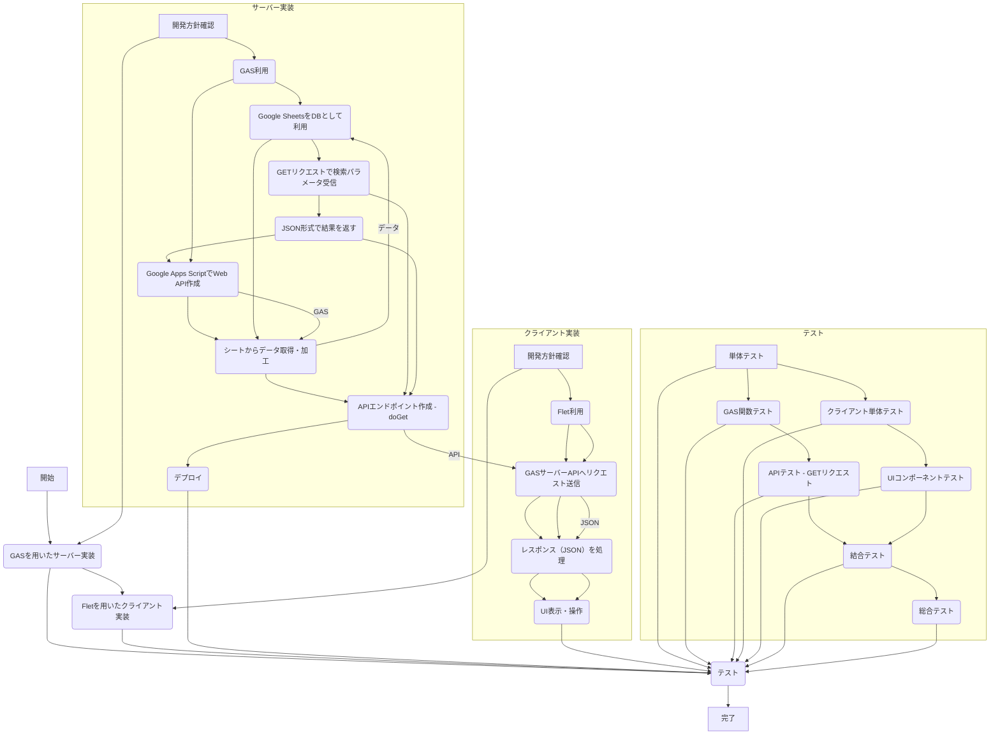

## サーバとクライアントの連携

```mermaid
graph TD
    A[開始] --> B(GASを用いたサーバー実装);
    B --> C(Fletを用いたクライアント実装);
    B --> D(テスト);
    C --> D;
    D --> E[完了];

    subgraph サーバー実装
        B1[開発方針確認] --> B2(GAS利用);
        B2 --> B3(Google SheetsをDBとして利用);
        B3 --> B4(GETリクエストで検索パラメータ受信);
        B4 --> B5(JSON形式で結果を返す);
        B5 --> B6(Google Apps ScriptでWeb API作成);
        B6 --> B7(シートからデータ取得・加工);
        B7 --> B8(APIエンドポイント作成 - doGet);
        B8 --> B9(デプロイ);
    end

    subgraph クライアント実装
        C1[開発方針確認] --> C2(Flet利用);
        C2 --> C3(GASサーバーAPIへリクエスト送信);
        C3 --> C4(レスポンス（JSON）を処理);
        C4 --> C5(UI表示・操作);
    end

    subgraph テスト
        D1[単体テスト] --> D2(GAS関数テスト);
        D2 --> D3(APIテスト - GETリクエスト);
        D1 --> D4(クライアント単体テスト);
        D4 --> D5(UIコンポーネントテスト);
        D3 --> D6(結合テスト);
        D5 --> D6;
        D6 --> D7(総合テスト);
    end

    B1 --> B;
    B2 --> B6;
    B3 --> B7;
    B4 --> B8;
    B5 --> B8;
    B9 --> D;

    C1 --> C;
    C2 --> C3;
    C3 --> C4;
    C4 --> C5;
    C5 --> D;

    D1 --> D;
    D2 --> D;
    D3 --> D;
    D4 --> D;
    D5 --> D;
    D6 --> D;
    D7 --> D;

    B6 --GAS--> B7;
    B7 --データ--> B3;
    B8 --API--> C3;
    C3 --JSON--> C4;
```